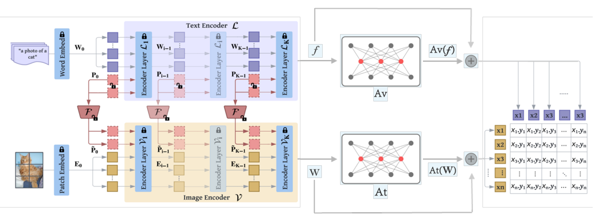

# Revist CLIP: Multi-perspective improvements on Vision-Language Model

> [Wenbo Hu](https://gordonhu608.github.io/), [Johnny Liu]

# :rocket: Highlights

> **
 Abstract:** *Large-scale contrastive vision-language pre-training
> has shown significant progress in visual representation
> learning. Unlike traditional visual systems trained by a
> fixed set of discrete labels, a new paradigm was introduced
> in CLIP to directly learn to align images with raw texts in
> an open-vocabulary setting. On downstream tasks, a carefully designed text prompt is employed to make zero-shot
> predictions. To avoid non-trivial prompt engineering, context optimization has been proposed to learn continuous vectors
> as task-specific prompts with few-shot training  examples. Instead of learning the input prompt token,
> an orthogonal way is learning the weight distributions of
> prompt, which is also very effective. An alternative
> path is fine-tuning with a light-weight feature adapter
> on the visual branch The most recent work introduces multimodal prompt learning, which uses a synergy function
> to simultaneously adapt language and vision branches for
> improved generalization. In our work, we revisit recent improvements in CLIP from different perspectives and propose
> an optimal way of combining the model’s architecture. We
> demonstrate that Data Augmentation (DA) and Test-Time
> Augmentation (TTA) are important for few-shot learning
> (FSL). We propose an end-to-end few-shot learning pipeline
> (DA + MaPLe + Adapters + TTA) that can be referenced for
> all downstream tasks. Compared with the state-of-the-art
> method ProDA  in FSL, our model achieves an absolute
> gain of 6.33% on the 1-shot learning setting and 4.43% on
> the 16-shot setting, averaged over 10 diverse image recognition datasets.* 

## Main Contributions

1) **Standard workflow for few-shot learning:** We combined current state-of-the-art models from different perspectives and achieved better performance.
We gained an average of 5.28% absolute improvement for [1,2,4,8,16] shots learning over 10 diverse image
recognition datasets than the best baseline model.
2) **Data and Test Time Augmentation:** We employed optimal Data Augmentation and Test Time Augmentation (TTA) and demonstrates TTA’s
importance in few-shot learning and thus should be used as a convention in future few-shot learning tasks

## :ballot_box_with_check: Supported Methods

| Method                    | Paper                                         |                             Configs                             |          Training Scripts          |
|---------------------------|:----------------------------------------------|:---------------------------------------------------------------:|:----------------------------------:|
| MaPLe                     | [arXiv](https://arxiv.org/abs/2210.03117)    | [link](configs/trainers/MaPLe/vit_b16_c2_ep5_batch4_2ctx.yaml)  |       [link](scripts/maple)        |
| CoOp                      | [IJCV 2022](https://arxiv.org/abs/2109.01134) |                  [link](configs/trainers/CoOp)                  |        [link](scripts/coop)        |
| Co-CoOp                   | [CVPR 2022](https://arxiv.org/abs/2203.05557) |                 [link](configs/trainers/CoCoOp)                 |       [link](scripts/cocoop)       |
| Ours                    | [arXiv](https://gordonhu608.github.io/files/revisitclip.pdf) |                  [link](configs/trainers/Ours)                  |        [link](scripts/ours)        |

## Results
### MaPLe in comparison with existing methods
Results reported below show accuracy for few shot training on [1,2,4,8,16] for across 10 recognition datasets averaged over 3 seeds.

| Name                                                      | 1-shot | 2-shot |   4-shot     | 8-shot |  16-shot | 
|-----------------------------------------------------------|:---------:|:----------:|:---------:|:------:|:------:|
| [CLIP](https://arxiv.org/abs/2103.00020)                  |   36.13   |   47.83    |   58.52  |   66.24   |   72.03    |   
| [CoOp](https://arxiv.org/abs/2109.01134)                  | 59.95 |   63.74    |    67.18  |  70.52  |  74.03  | 
| [CLIP-Adapter](https://arxiv.org/abs/2110.04544)                |   62.13   |   65.64    |   69.07   |   72.55  |   76.  |  
| [ProDA](https://arxiv.org/abs/2205.03340)                |   65.19   |   68.59    |   71.4   |   74.21   |   76.78   | 
| [Ours](https://gordonhu608.github.io/files/revisitclip.pdf)          |   **71.94** | **74.12**  | **78.48** |   **80.2**    |   **82.64**   | 

## Installation 
For installation and other package requirements, please follow the instructions detailed in [INSTALL.md](docs/INSTALL.md). 

## Data preparation
Please follow the instructions at [DATASETS.md](docs/DATASETS.md) to prepare all datasets.

## Training and Evaluation
Please refer to the [RUN.md](docs/RUN.md) for detailed instructions on training, evaluating and reproducing the results using our pre-trained models.

## Contact
If you have any questions, please create an issue on this repository or contact at w1hu@ucsd.edu

## Acknowledgements

Our code is based on [Co-CoOp, CoOp](https://github.com/KaiyangZhou/CoOp) and [MaPLe](https://github.com/muzairkhattak/multimodal-prompt-learning) repository. We thank the authors for releasing their code. If you use our model and code, please consider citing these works as well.

