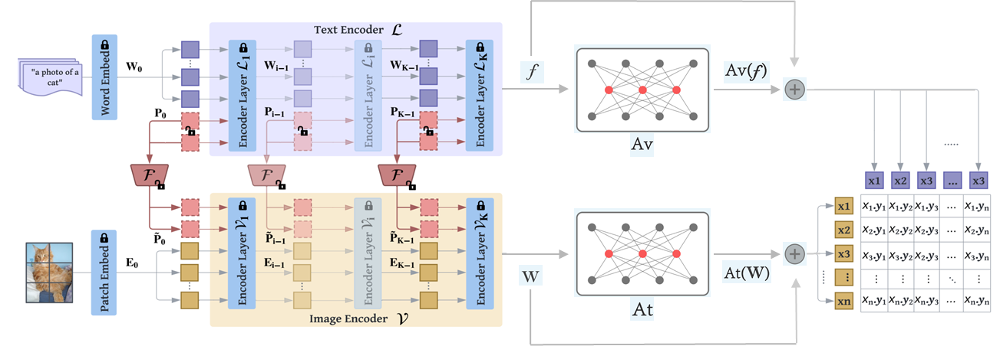
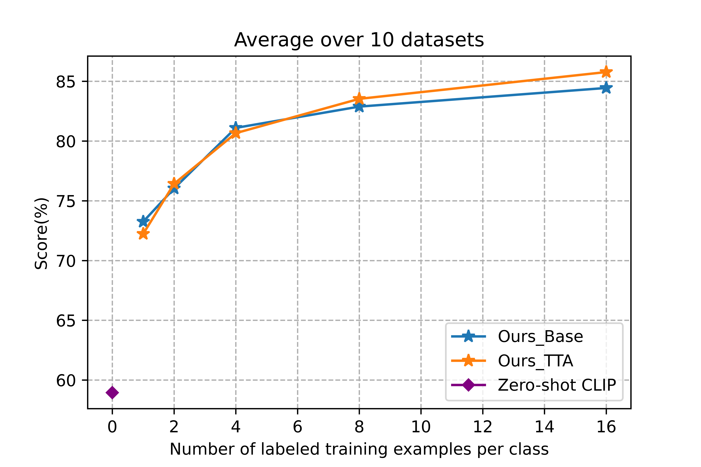

by Wenbo Hu (w1hu@ucsd.edu), Johnny Liu (jrl002@ucsd.edu)

---

## Introduction

Large-scale contrastive vision-language pre-training has shown significant progress in visual representation learning. Unlike traditional 
visual systems trained by a fixed set of discrete labels, a new paradigm was introduced in CLIP to directly learn to align 
images with raw texts in an open-vocabulary setting. On downstream tasks, a carefully designed text prompt is employed 
to make zero-shot predictions. To avoid non-trivial prompt engineering, context optimization has been proposed to learn 
continuous vectors as task-specific prompts with few-shot training examples. Instead of learning the input prompt token, 
an orthogonal way is learning the weight distributions of
prompt , which is also very effective. An alternative path is fine-tuning with a light-weight feature adapter 
on the visual branch The most recent work introduces multimodal prompt learning, which uses a synergy function
to simultaneously adapt language and vision branches for
improved generalization. 

---

## Methodology 
In our work, we revisit recent improvements in CLIP from different perspectives and propose
an optimal way of combining the model’s architecture. We
demonstrate that Data Augmentation (DA) and Test-Time
Augmentation (TTA) are important for few-shot learning
(FSL). We propose an end-to-end few-shot learning pipeline
(DA + MaPLe + Adapters + TTA) that can be referenced for
all downstream tasks. Compared with the state-of-the-art
method ProDA in FSL, our model achieves an absolute
gain of 6.33% on the 1-shot learning setting and 4.43% on
the 16-shot setting, averaged over 10 diverse image recognition datasets.

---

## Results
### Dataset
Following CLIP and CoOP, we evaluated our model on 11 downstream classification datasets,including general object recognition (ImageNet-1k ,
Caltech-101), fine-grained object recognition (Food101, Oxford-IIIT Pets, Stanford Cars,
Oxford Flowers 102, and FGVC Aircraft),
human interactions classification UCF-101, large scale
scene recognition dataset (SUN397), remote sensing
recognition (EuroSAT), and texture recognition
(DTD). Note here because of constrained resources,
we are unable to train Imagenet, it will be delayed to
future experiments

### Main results
We showed the few-shot learning on 10 datasets. Not including ImageNet yet. Our method consistently and significantly shows
better performance over previous baselines across different training shots. Here Ours-best is picking from the best performance between
using TTA and not using TTA in our framework.

We show the absolute improvement of our approach compared to Zero shot CLIP and
state-of-the-art baselines on each downstream task. (a) We compare the hand-crafted prompts to Our method with 16 samples per class. (b)
Our method is compared with the best performance among other baselines (including CoOp, CLIP-Adapter, Linear-probe CLIP,
and ProDA ) by their average results over various shots (1, 2, 4, 8, and 16).

Test Time Augmentation (TTA) is less valued in the few-shot learning community. However, due to the limited samples we can acquire in this task,
data augmentation is a neglectable approach to get a more
robust data distribution just like in the real world. We performed few-shot learning following our framework and then
compared the performance between using TTA and not using TTA. We notice that using TTA degrades the
performance for 1-shot and 2-shot settings. But it improves
performance stably when we have more training samples
per class. It indicates that with a little bit more samples,
TTA is able to capture a better and more robust data distribution like the real world. 

---
## Conclusion

We revisit current state-of-the-art methods
in Contrastive Vision-Language Models from different perspectives. We combined orthogonal model architecture and
propose optimal data augmentation and test-time augmentation to enhance the limited few-shot data to a more robust
distribution. Our work shows that multimodal prompt learning i.e learning the context prompt from both visual branch
and text branch is currently the best way to address downstream visual recognition tasks with a pre-trained VLM.
According to the experimental results, our method outperforms competitive baselines on ten image classification
datasets under different few-shot setups. Our work follows
an end-to-end approach that can be referred to as a standard
workflow for few-shot learning as we combined new breakthroughs in the field. In the future, we will focus more on
multimodal prompt learning and parametrize it by a distribution from a bayesian perspective to improve the performance. We hope our approach will inspire future work.

---
